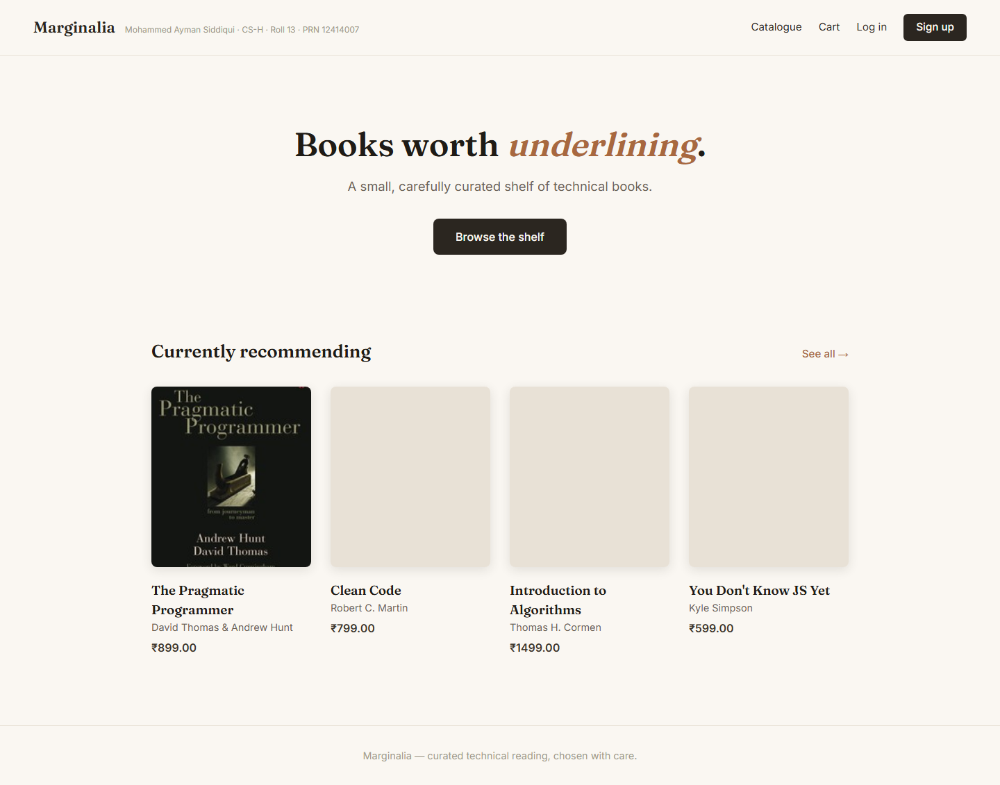
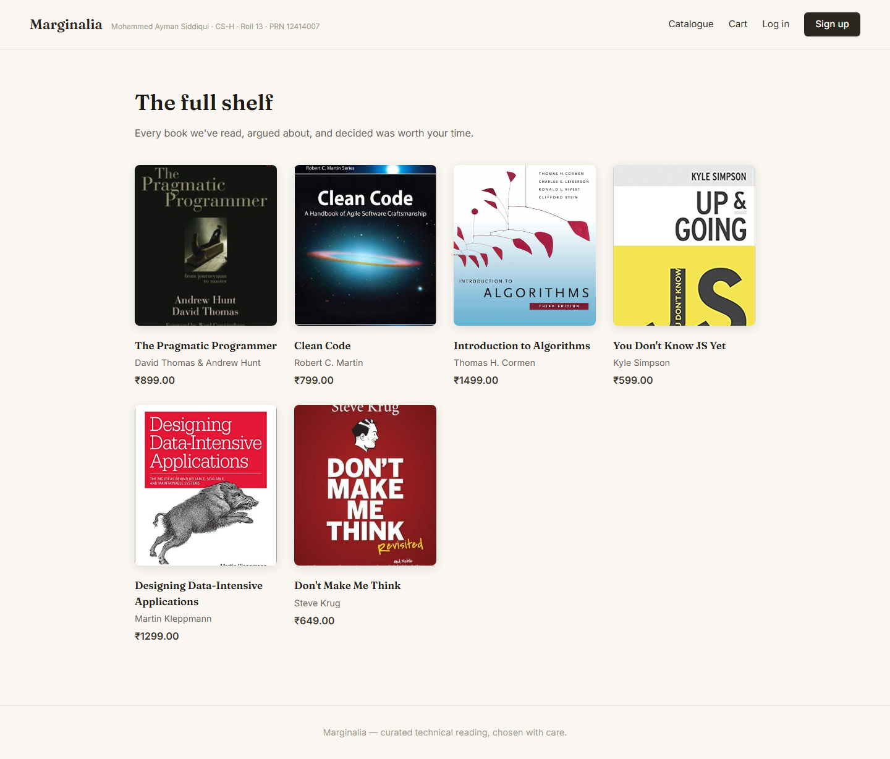
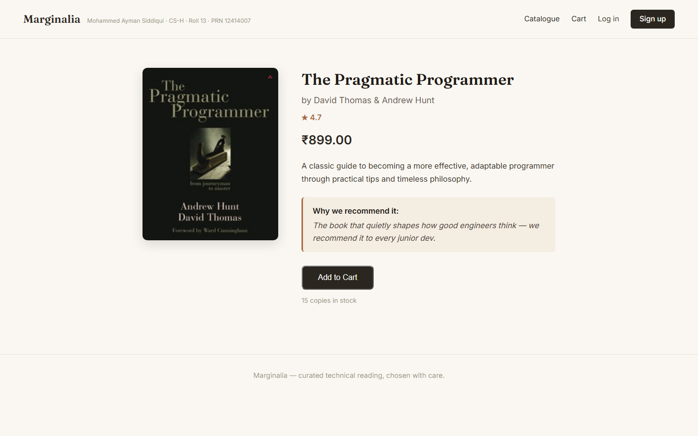
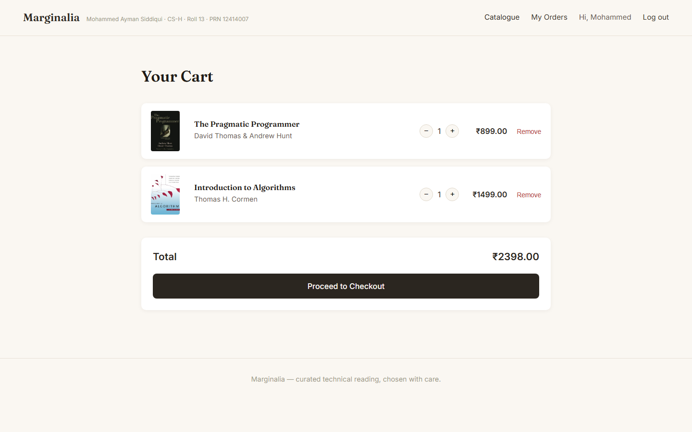
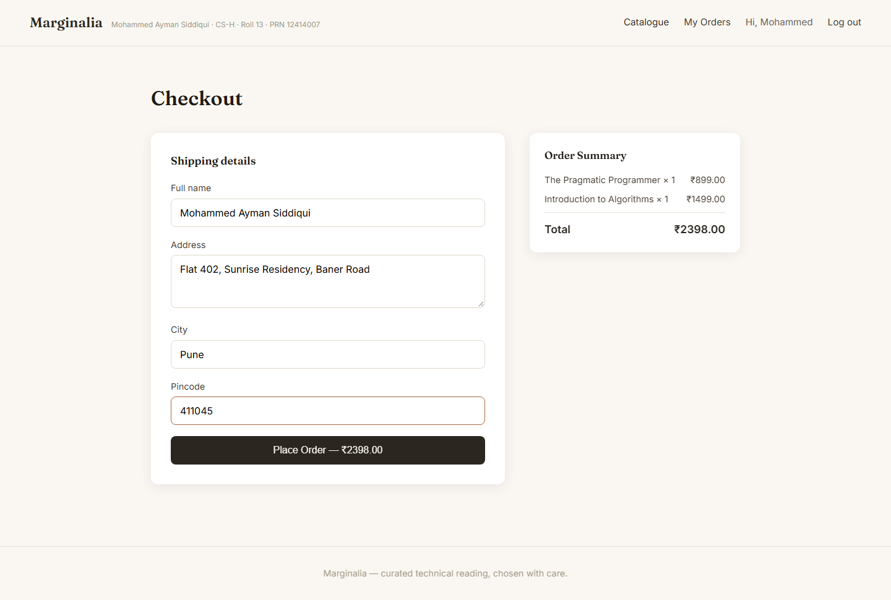
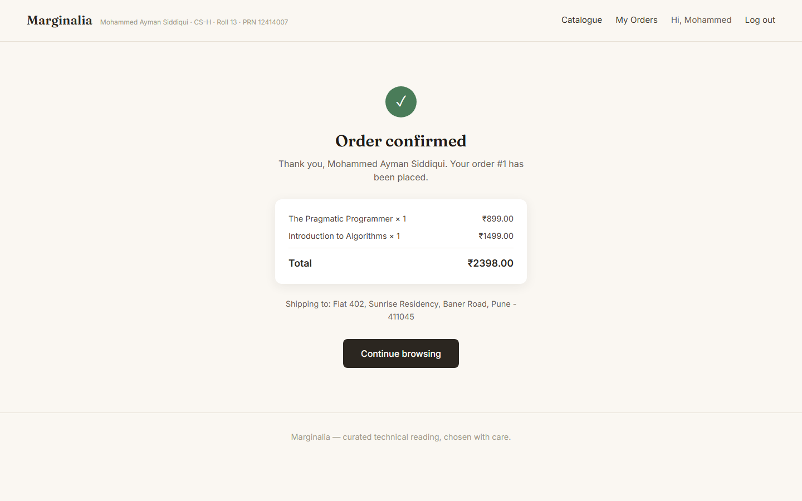
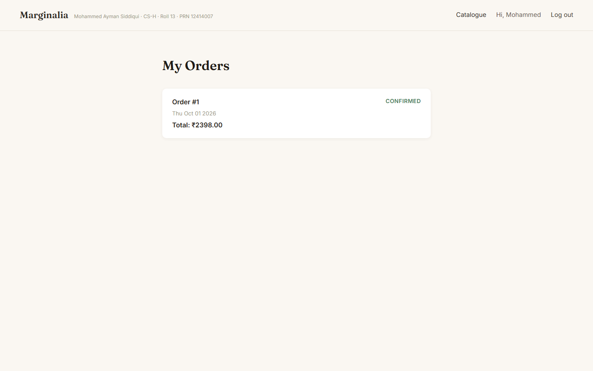

# Marginalia — Curated Technical Bookstore

A curated online bookstore for developers, built to feel like a real editorial bookshop rather than a generic e-commerce template.

## Concept
Instead of a generic product catalogue, Marginalia is positioned as a small, opinionated bookshop — every book comes with a short "curator's note" explaining why it's worth reading, similar to independent bookshops like Bookshop.org.

## Features
- Editorial-style homepage with featured picks
- Full catalogue browsing
- User registration with hashed passwords (bcrypt)
- Session-based login/logout
- MySQL-backed book and user data

## Tech Stack
- Node.js + Express.js
- EJS templating
- MySQL (mysql2)
- bcrypt for password hashing
- express-session for auth state

## Setup
1. Create the MySQL database using the schema (see below)
2. Configure `.env` with your DB credentials
3. `npm install`
4. `node server.js`
5. Visit `http://localhost:3000`

## Database Schema
- `users`: id, name, email, password (hashed), created_at
- `books`: id, title, author, price, genre, description, curator_note, cover_url, rating, stock

## Security Notes
- Passwords hashed with bcrypt before storage
- Parameterized SQL queries throughout (no string concatenation)
- Session secret stored in environment variables

## Screenshots

